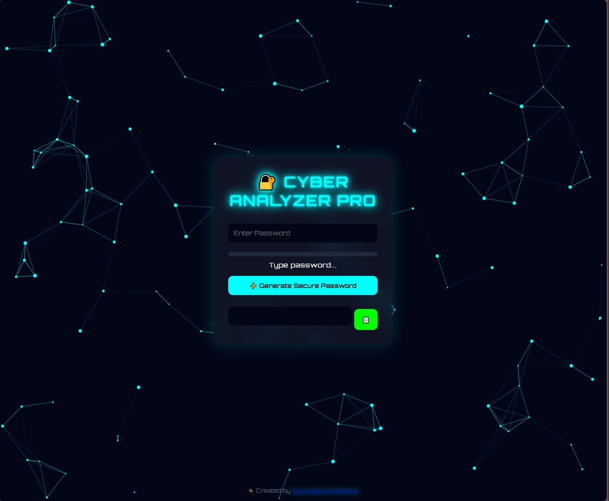

# 🔐 Password Analyzer

**Password Analyzer** adalah aplikasi web interaktif untuk menganalisis kekuatan password, menghasilkan password aman, dan memberikan pengalaman visual futuristik ala hacker. Dibangun dengan **HTML, CSS, dan JavaScript**, siap dijalankan di browser dan responsive untuk mobile maupun desktop.

---

## ⚡ Fitur Utama

- **Password Strength Analyzer** : Menilai kekuatan password secara real-time dengan indikator warna dan teks.  
- **Password Generator Animasi** : Membuat password secara otomatis dengan animasi karakter demi karakter.  
- **Particle Background Interaktif** : Background partikel cyan bergerak mengikuti mouse, memberikan nuansa cyber.  
- **Glitch Input Effect** : Efek input “hacker style” saat mengetik password.  
- **Copy to Clipboard** : Salin password hasil generate dengan satu klik + animasi pulse.  
- **Responsive & Modern UI** : Glass UI dengan glow, shadow, dan animasi hover.  
- **Hacker Console Logs** : Efek console log interaktif untuk menambah vibe cyber.

---

## 🖥️ Preview



---

## 🚀 Cara Menjalankan

1. Clone repository:

```bash
git clone https://github.com/agusadhitama/password-analyzer.git
```
2. Buka file index.html di browser favorit kamu.
3. Mulai ketik password atau klik Generate Secure Password.
4. Atau klik link ini : https://agusadhitama.github.io/password-analyzer/

---

## 💻 Teknologi

- HTML5 - Struktur halaman
- CSS3 - Styling modern, glass UI, glow & glitch effects
- JavaScript - Interaktivitas, password generator, particle background

---

## 🌟 Credit

**Agus Satria Adhitama**

---

## 📜 Lisensi

MIT License © 2026 Agus Satria Adhitama
